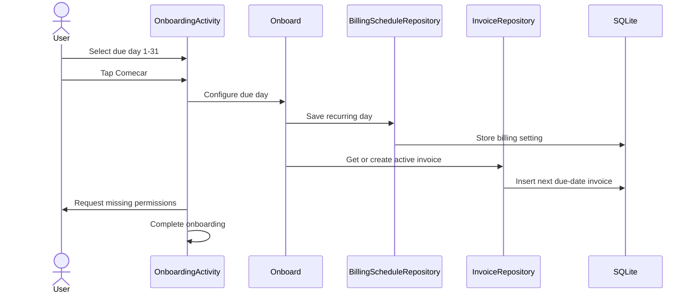
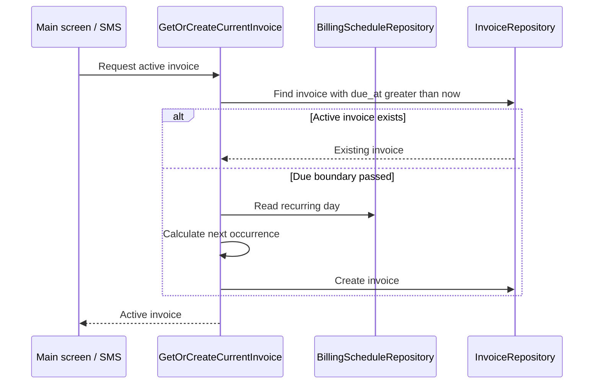

# CP-002 Technical Plan

## Summary

Replace the hard-coded onboarding due date with a required recurring due-day
selection. Store the schedule in SQLite and use it to find or create the active
invoice from both the main screen and SMS transaction flow.

## Current Behavior

- `OnboardingActivity.kt` creates an invoice due exactly seven days after the
  user taps **Comecar**.
- `Onboard.kt` already accepts an invoice due timestamp and saves an empty
  invoice.
- `InvoiceRepositorySqlite.kt` selects the current invoice by its creation
  month, not by its due date.
- `RecordTransaction.kt` fails when no invoice was created in the current
  calendar month.
- `activity_onboarding.xml` contains no form input.
- SQLite stores epoch-millisecond values in columns declared as `TEXT`.

## Decisions

### Due-Day Semantics

- Store an integer from 1 through 31.
- Treat local midnight at the start of the due date as the invoice boundary.
- The active invoice must have `due_at > now`.
- If this month's selected day is equal to or before today, calculate the first
  due date in the next month.
- Clamp days that do not exist in a month to that month's final day.
- Preserve the configured day when clamping. For example, a schedule for day 31
  produces February 28 and then March 31.

### Persistence

Add a singleton billing settings table alongside invoice data:

```sql
CREATE TABLE billing_settings (
    id INTEGER PRIMARY KEY CHECK (id = 1),
    due_day INTEGER NOT NULL CHECK (due_day BETWEEN 1 AND 31)
);
```

Increment the database version and recreate local tables during upgrade. This
is an approved destructive reset. Version the onboarding completion preference
at the same time so an upgraded installation returns to onboarding before it
tries to load an invoice.

Change persisted timestamp columns to `INTEGER`, because repositories write and
read epoch milliseconds. Add a uniqueness constraint for invoice due timestamps
so retries and concurrent entry points cannot create duplicate cycle invoices.

### Persistence Alternatives

SharedPreferences was considered for the recurring day. It avoids a database
migration, but splits billing rules and invoices across stores, prevents atomic
database operations, and weakens repository-level tests.

Deriving the recurring day from the previous invoice was also considered. It
cannot preserve an intended day 31 after clamping the February invoice to day
28, so it is not suitable.

## Component Flow





## Implementation Steps

1. Add a due-day selector to `activity_onboarding.xml`, keeping the existing
   typography, colors, illustration, and primary action.
2. Make the layout work on small screens and mark decorative images correctly
   for accessibility.
3. Add Portuguese label, placeholder, selected-value, and error strings to
   `strings.xml`.
4. Keep **Comecar** disabled until the user explicitly selects a day and restore
   that selection after activity recreation.
5. Add a billing schedule domain type that validates the day and calculates the
   next local due-date boundary, including short months and year rollover.
6. Add `BillingScheduleRepository` and its SQLite implementation.
7. Update `SqliteDb` with the billing settings table, integer timestamp columns,
   due-date uniqueness, database version, and approved reset behavior.
8. Replace `InvoiceRepository.getForCurrentMonth()` with active-invoice lookup
   ordered by due date.
9. Add an idempotent get-or-create-active-invoice use case shared by
   `GetCurrentInvoice`, `RecordTransaction`, and onboarding.
10. Update `Onboard` to persist the recurring day and create the first invoice.
11. Remove the unused `persistentNotification` onboarding input.
12. Mark onboarding complete only after persistence succeeds.
13. Request only missing permissions and continue immediately when all required
    permissions are already granted.
14. Preserve SQL `NULL` when hydrating `paid_at` while updating invoice queries.

## Main Entry Points

- `app/src/main/kotlin/com/inodaf/cowpaw/OnboardingActivity.kt`
- `app/src/main/kotlin/com/inodaf/cowpaw/MainActivity.kt`
- `app/src/main/kotlin/com/inodaf/cowpaw/usecases/Onboard.kt`
- `app/src/main/kotlin/com/inodaf/cowpaw/usecases/GetCurrentInvoice.kt`
- `app/src/main/kotlin/com/inodaf/cowpaw/usecases/RecordTransaction.kt`
- `app/src/main/kotlin/com/inodaf/cowpaw/domain/InvoiceRepository.kt`
- `app/src/main/kotlin/com/inodaf/cowpaw/outbound/InvoiceRepositorySqlite.kt`
- `app/src/main/kotlin/com/inodaf/cowpaw/config/SqliteDb.kt`
- `app/src/main/kotlin/com/inodaf/cowpaw/config/di/Persistence.kt`
- `app/src/main/kotlin/com/inodaf/cowpaw/config/di/UseCases.kt`
- `app/src/main/res/layout/activity_onboarding.xml`
- `app/src/main/res/values/strings.xml`

## Test Plan

### Unit Tests

- Reject due days outside 1 through 31.
- Calculate due dates before, on, and after the selected day.
- Clamp days 29 through 31 in leap and non-leap February.
- Preserve the configured day after a clamped month.
- Handle December-to-January rollover and local time-zone boundaries.
- Reuse an existing active invoice.
- Create one invoice after the due boundary.
- Return a persistence failure without completing onboarding.
- Associate a transaction with the newly active invoice.

### Instrumentation Tests

- Persist and retrieve billing settings from SQLite.
- Prevent duplicate invoices for the same due timestamp.
- Require an explicit onboarding selection.
- Restore the selected day after activity recreation.
- Handle none, some, and all required permissions already being granted.

### Verification

```shell
./gradlew testDebugUnitTest
./gradlew assembleDebug
./gradlew lintDebug
./gradlew connectedDebugAndroidTest
```

`connectedDebugAndroidTest` requires an available emulator or device.

## API Contract

Cow Paw has no remote HTTP, GraphQL, or RPC API. This change introduces no
OpenAPI contract.

## Pending Decisions

None.
