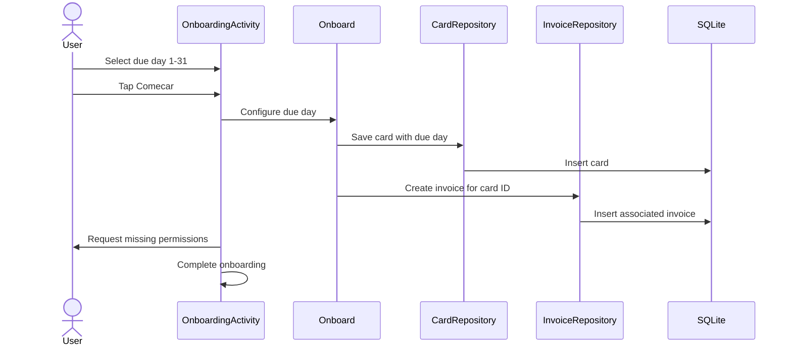
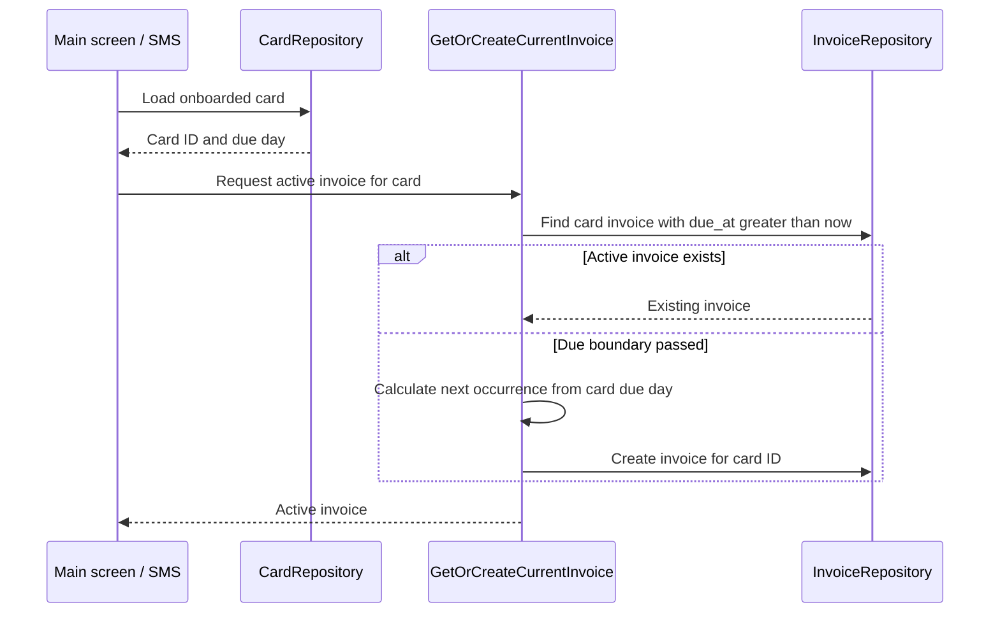

# CP-002 Technical Plan

## Summary

Replace the hard-coded onboarding due date with a required recurring due-day
selection. Create a card with that due day, associate invoices with the card,
and use its configuration to find or create the active invoice from both the
main screen and SMS transaction flow.

## Current Behavior

- `OnboardingActivity.kt` creates an invoice due exactly seven days after the
  user taps **Comecar**.
- `Onboard.kt` already accepts an invoice due timestamp and saves an empty
  invoice.
- `InvoiceRepositorySqlite.kt` selects the current invoice by its creation
  month, not by its due date.
- `RecordTransaction.kt` fails when no invoice was created in the current
  calendar month.
- `activity_onboarding.xml` contains no form input.
- SQLite stores epoch-millisecond values in columns declared as `TEXT`.

## Decisions

### Due-Day Semantics

- Store an integer from 1 through 31 on the card.
- Store the concrete due timestamp on each invoice. The card's `due_day` is the
  recurring rule, while an invoice's `due_at` identifies one monthly occurrence.
- Treat local midnight at the start of the due date as the invoice boundary.
- A card's active invoice must have `due_at > now`.
- If this month's selected day is equal to or before today, calculate the first
  due date in the next month.
- Clamp days that do not exist in a month to that month's final day.
- Preserve the configured day when clamping. For example, a card due on day 31
  produces February 28 and then March 31.

### Card Model

Introduce a `Card` entity with a unique ID and due day. Onboarding creates one
card under the hood and associates the first invoice with it. Main screen and
SMS flows use that only card for now, while active-invoice operations receive a
card ID explicitly so future multi-card entry points do not depend on a global
invoice.

Managing multiple cards and identifying which card produced an SMS transaction
remain out of scope.

### Persistence

Add a cards table and associate every invoice with a card:

```sql
CREATE TABLE cards (
    id TEXT PRIMARY KEY,
    due_day INTEGER NOT NULL CHECK (due_day BETWEEN 1 AND 31)
);

CREATE TABLE invoices (
    id TEXT PRIMARY KEY,
    amount INTEGER NOT NULL,
    status TEXT CHECK(status IN ('Open', 'Paid')) NOT NULL,
    due_at INTEGER NOT NULL,
    paid_at INTEGER,
    created_at INTEGER NOT NULL,
    card_id TEXT NOT NULL,
    FOREIGN KEY (card_id) REFERENCES cards(id) ON DELETE CASCADE,
    UNIQUE (card_id, due_at)
);
```

`cards.due_day` cannot replace `invoices.due_at`: the day alone does not identify
the invoice's month or year, and it does not record a clamped date such as
February 28 for a card configured with day 31. Active-invoice queries and invoice
history therefore use the concrete `due_at` value.

Increment the database version and recreate local tables during upgrade. This
is an approved destructive reset. Version the onboarding completion preference
at the same time so an upgraded installation returns to onboarding before it
tries to load an invoice.

Change persisted timestamp columns to `INTEGER`, because repositories write and
read epoch milliseconds. Scope invoice lookup and due-date uniqueness by card
so retries and concurrent entry points cannot create duplicate cycle invoices.
Enable SQLite foreign-key enforcement when configuring the database.

Create the onboarding card and first invoice in one database transaction. If
the operation is retried, it must return or reuse the already-created card and
invoice rather than create another pair.

### Persistence Alternatives

Singleton billing settings in SQLite or SharedPreferences were considered for
the recurring day. Both make the due day global and would need replacement when
Cow Paw supports multiple cards. A card entity keeps the due day with the object
that owns the invoice cycle.

Deriving the recurring day from the previous invoice was also considered. It
cannot preserve an intended day 31 after clamping the February invoice to day
28, so it is not suitable.

## Component Flow





## Implementation Steps

1. Add a due-day selector to `activity_onboarding.xml`, keeping the existing
   typography, colors, illustration, and primary action.
2. Make the layout work on small screens and mark decorative images correctly
   for accessibility.
3. Add Portuguese label, placeholder, selected-value, and error strings to
   `strings.xml`.
4. Keep **Comecar** disabled until the user explicitly selects a day and restore
   that selection after activity recreation.
5. Add a `Card` domain entity with an ID, validated due day, and next local
   due-date calculation, including short months and year rollover.
6. Add `CardRepository` and its SQLite implementation.
7. Add `cardId` to `Invoice` and require it when creating or hydrating invoices.
8. Update `SqliteDb` with the cards table, invoice foreign key, integer timestamp
   columns, card-scoped due-date uniqueness, database version, and approved
   reset behavior. Enable SQLite foreign-key enforcement.
9. Replace `InvoiceRepository.getForCurrentMonth()` with card-scoped
   active-invoice lookup ordered by due date.
10. Add an idempotent get-or-create-active-invoice use case that accepts a card
    and is shared by `GetCurrentInvoice`, `RecordTransaction`, and onboarding.
11. Update `Onboard` to create the card and its first associated invoice as one
    idempotent database operation.
12. Remove the unused `persistentNotification` onboarding input.
13. Mark onboarding complete only after card and invoice persistence succeed.
14. Request only missing permissions and continue immediately when all required
    permissions are already granted.
15. Preserve SQL `NULL` when hydrating `paid_at` while updating invoice queries.

## Main Entry Points

- `app/src/main/kotlin/com/inodaf/cowpaw/OnboardingActivity.kt`
- `app/src/main/kotlin/com/inodaf/cowpaw/MainActivity.kt`
- `app/src/main/kotlin/com/inodaf/cowpaw/usecases/Onboard.kt`
- `app/src/main/kotlin/com/inodaf/cowpaw/usecases/GetCurrentInvoice.kt`
- `app/src/main/kotlin/com/inodaf/cowpaw/usecases/RecordTransaction.kt`
- `app/src/main/kotlin/com/inodaf/cowpaw/domain/Card.kt`
- `app/src/main/kotlin/com/inodaf/cowpaw/domain/CardRepository.kt`
- `app/src/main/kotlin/com/inodaf/cowpaw/domain/InvoiceRepository.kt`
- `app/src/main/kotlin/com/inodaf/cowpaw/outbound/CardRepositorySqlite.kt`
- `app/src/main/kotlin/com/inodaf/cowpaw/outbound/InvoiceRepositorySqlite.kt`
- `app/src/main/kotlin/com/inodaf/cowpaw/config/SqliteDb.kt`
- `app/src/main/kotlin/com/inodaf/cowpaw/config/di/Persistence.kt`
- `app/src/main/kotlin/com/inodaf/cowpaw/config/di/UseCases.kt`
- `app/src/main/res/layout/activity_onboarding.xml`
- `app/src/main/res/values/strings.xml`

## Test Plan

### Unit Tests

- Reject due days outside 1 through 31.
- Calculate due dates before, on, and after the selected day.
- Clamp days 29 through 31 in leap and non-leap February.
- Preserve the configured day after a clamped month.
- Handle December-to-January rollover and local time-zone boundaries.
- Create a card with the selected due day during onboarding.
- Reuse the card and invoice when onboarding is retried.
- Associate every created invoice with its card ID.
- Reuse an existing active invoice for the requested card.
- Create one card-scoped invoice after the due boundary.
- Keep invoices from different cards isolated in repository queries.
- Return a persistence failure without completing onboarding.
- Associate a transaction with the newly active invoice.

### Instrumentation Tests

- Persist and retrieve cards from SQLite.
- Enforce the invoice-to-card foreign key.
- Prevent duplicate invoices for the same card and due timestamp.
- Require an explicit onboarding selection.
- Restore the selected day after activity recreation.
- Handle none, some, and all required permissions already being granted.

### Verification

```shell
./gradlew testDebugUnitTest
./gradlew assembleDebug
./gradlew lintDebug
./gradlew connectedDebugAndroidTest
```

`connectedDebugAndroidTest` requires an available emulator or device.

## API Contract

Cow Paw has no remote HTTP, GraphQL, or RPC API. This change introduces no
OpenAPI contract.

## Pending Decisions

None.
